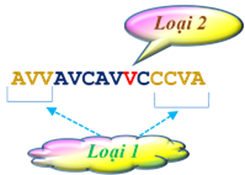

			<h2><strong>VCA</strong><strong> </strong></h2>

Olympic Tin học 2020 của sinh viên được tổ chức ở Cần Thơ. Một đoàn sinh viên dự Olympic Tin học 2020 đi máy bay tới Cần Thơ. Trong phòng chờ lên máy bay mọi người đều rất háo hức. Thật không may, trên bảng tin xuất hiện thông báo hiện nay ở khu vực sân bay Cần Thơ (VCA) đang có mưa giông rất to, giờ khởi hành phải lùi lại <strong><em>k</em></strong> phút.

Trong thời gian chờ đợi, Trưởng đoàn tải về qua Wi-fi một bản tin, xóa hết các ký tự không nằm trong tập {<strong><em>V</em></strong>,<strong><em>C</em></strong>,<strong><em>A</em></strong>} và nhận được xâu <strong><em>s</em></strong> chỉ chứa các ký tự thuộc tập {<strong><em>V</em></strong>,<strong><em>C</em></strong>,<strong><em>A</em></strong>} đã nêu. Kết quả thực hiện chương trình cho thấy việc xóa một ký tự ở đầu hay cuối xâu được thực hiện rất nhanh, còn xóa ký tự không phải là đầu hay cuối xâu – mất rất nhiều thời gian hơn.

Trưởng đoàn gửi xâu <strong><em>s</em></strong> nhận được cho các thành viên trong đoàn, yêu cầu tìm cách xóa các ký tự bằng cách thực hiện các phép biến đổi:

<ul>
	<li style="text-align:justify">Loại 1:&nbsp;Xóa một ký tự ở đầu hoặc cuối xâu trong kết quả xử lý đang có,</li>
	<li style="text-align:justify">Loại 2:&nbsp;Xóa một ký tự không phải là ở đầu hoặc cuối xâu trong kết quả xử lý đang có.</li>
</ul>

sao cho kết quả cuối cùng là một xâu chứa đúng <strong><em>k</em></strong> ký tự mỗi loại và số lần thực hiện phép biến đổi loại 2 là ít nhất.

Ai gửi về giá trị đúng của số phép biến đổi loại 2 ít nhất cần thực hiện sẽ có phần thưởng.

Ví dụ, với <strong><em>k</em></strong> = 2 và <strong><em>s</em></strong> = ‘<strong>AVVAVCAVVCCCVA</strong>’:

Hãy xác định giá trị cần tìm để được thưởng.

<h3 style="text-align: justify;"><strong>Input</strong></h3>

Vào từ thiết bị nhập chuẩn:

<ul>
	<li style="text-align:justify">Dòng đầu tiên chứa số nguyên <strong><em>k</em></strong> (1 ≤ <strong><em>k</em></strong> ≤ <strong><em>n</em></strong>/3, trong đó <strong><em>n</em></strong> – độ dài xâu ở dòng sau)</li>
	<li style="text-align:justify">Dòng thứ 2 chứa xâu <strong><em>s</em></strong> độ dài không vượt quá 2×105 chỉ chứa các ký tự trong tập {<strong><em>V</em></strong>, <strong><em>C</em></strong>, <strong><em>A</em></strong>}.</li>
</ul>

<h3 style="text-align: justify;"><strong>Output</strong></h3>

Đưa ra file văn bản VCA.OUT một số nguyên – số phép biến đổi loại 2 ít nhất cần thực hiện. Nếu không tồn tại cách xóa – đưa ra số -1.

<h3 style="text-align: justify;"><strong>Ví dụ</strong></h3>

<table border="1" cellpadding="1" cellspacing="1" style="width:100%">
	<tbody>
		<tr>
			<td style="text-align:center; vertical-align:top; width:50%"><strong>INPUT</strong></td>
			<td style="text-align:center; vertical-align:top; width:50%"><strong>OUTPUT</strong></td>
		</tr>
		<tr>
			<td style="vertical-align:top; width:50%">2 
             AVVAVCAVVCCCVA
 
             </td>
			<td style="vertical-align:top; width:50%">1</td>
		</tr>
	</tbody>
</table>