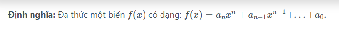

Viết chương trình cộng 2 đa thức A và B.

<!--<h3>\(S={ }\)</h3>
-->

<h3 style="text-align: justify;"><strong>Input</strong></h3>

Dãy các số trong đó:

<ul>
	<li style="text-align: justify;">Số nguyên đầu tiên (0 &lt;= n &lt;= 100): số lượng đơn thức trong đa thức A.</li>
	<li style="text-align: justify;">n cặp số tiếp theo , mỗi cặp số là một đơn thức gồm: hệ số (số thực) và số mũ (số nguyên &gt;= 0).</li>
	<li style="text-align: justify;">Số nguyên tiếp theo (0 &lt;= m &lt;= 100): số lượng đơn thức trong đa thức B.</li>
	<li style="text-align: justify;">m cặp số tiếp theo, mỗi cặp số là một đơn thức gồm: hệ số (số thực) và số mũ (số nguyên &gt;= 0).</li>
</ul>

<strong>Lưu ý: </strong>Các đơn thức trong 1 đa thức được nhập vào theo thứ tự giảm dần của số mũ, và không có đơn thức nào có cùng số mũ.

<h3 style="text-align: justify;"><strong>Output</strong></h3>

Như ví dụ bên dưới.

Lưu ý xuất đa thức:

<ul>
	<li style="text-align: justify;">Biến trong đa thức ký hiệu là x.</li>
	<li style="text-align: justify;">Số mũ ký hiệu ^.</li>
	<li style="text-align: justify;">Phép nhân không ghi ký hiệu.</li>
	<li style="text-align: justify;">Các ký tự biểu diễn đa thức ghi liền nhau (không khoảng trắng).</li>
	<li style="text-align: justify;">Đơn thức đầu tiên nếu hệ số là số dương thì không được xuất dấu + trước hệ số.</li>
	<li style="text-align: justify;">Đơn thức có hệ số bằng 0 thì không xuất đơn thức đó.</li>
	<li style="text-align: justify;">Đơn thức có hệ số bằng 1 hoặc -1 thì không xuất số 1.</li>
	<li style="text-align: justify;">Đơn thức có số mũ bằng 0 thì chỉ xuất hệ số của đơn thức.</li>
	<li style="text-align: justify;">Đơn thức có số mũ bằng 1 thì không xuất số mũ.</li>
</ul>

<h3 style="text-align: justify;"><strong>Ví dụ</strong></h3>

<table align="center" border="1" cellpadding="1" cellspacing="1" style="width:80%">
	<thead>
		<tr>
			<th scope="col" style="text-align: center;"><strong>Input</strong></th>
			<th scope="col" style="text-align: center;"><strong>Output</strong></th>
		</tr>
	</thead>
	<tbody>
		<tr>
			<td>6 
			4 20 
			-10 10 
			5 5 
			2 4 
			1 1 
			-10.5 0 
			7 
			5 30 
			0 25 
			-4 20 
			10 10 
			-6 5 
			-1 4 
			9 1</td>
			<td>Da thuc A: 4x^20-10x^10+5x^5+2x^4+x-10.5 
			Da thuc B: 5x^30-4x^20+10x^10-6x^5-x^4+9x 
			A+B = 5x^30-x^5+x^4+10x-10.5</td>
		</tr>
		<tr>
			<td>3 
			0 4 
			5 3 
			9 1 
			4 
			0 10 
			0 5 
			-5 3 
			-9 1</td>
			<td>Da thuc A: 5x^3+9x 
			Da thuc B: -5x^3-9x 
			A+B = 0</td>
		</tr>
		<tr>
			<td>5 
			4 15 
			-10 10 
			5 5 
			2 4 
			-10.5 0 
			1 
			0 2</td>
			<td>Da thuc A: 4x^15-10x^10+5x^5+2x^4-10.5 
			Da thuc B: 0 
			A+B = 4x^15-10x^10+5x^5+2x^4-10.5</td>
		</tr>
	</tbody>
</table>
		
