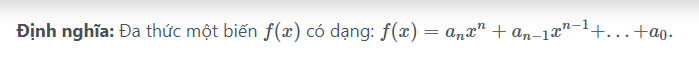

Viết chương trình nhập xuất đa thức một biến <mi>f</mi><mo stretchy=&quot;false&quot;>(</mo><mi>x</mi><mo stretchy=&quot;false&quot;>)</mo></math>" role="presentation">f(x)<math xmlns="http://www.w3.org/1998/Math/MathML"><mi>f</mi><mo stretchy="false">(</mo><mi>x</mi><mo stretchy="false">)</mo></math>. Sau đó nhập giá trị biến <mi>x</mi></math>" role="presentation">x<math xmlns="http://www.w3.org/1998/Math/MathML"><mi>x</mi></math>&nbsp;và tính giá trị <mi>f</mi><mo stretchy=&quot;false&quot;>(</mo><mi>x</mi><mo stretchy=&quot;false&quot;>)</mo></math>" role="presentation">f(x)<math xmlns="http://www.w3.org/1998/Math/MathML"><mi>f</mi><mo stretchy="false">(</mo><mi>x</mi><mo stretchy="false">)</mo></math>&nbsp;với kết quả hiển thị chính xác 2 số sau dấu thập phân.

<!--<h3>\(S={ }\)</h3>
-->

<h3 style="text-align:justify"><strong>Input</strong></h3>

Dãy các số trong đó:

<ul>
	<li style="text-align:justify">Số nguyên đầu tiên&nbsp;<mo stretchy=&quot;false&quot;>(</mo><mn>0</mn><mo>&amp;#x2264;</mo><mi>n</mi><mo>&amp;#x2264;</mo><mn>100</mn><mo stretchy=&quot;false&quot;>)</mo></math>" role="presentation">(0≤n≤100)<math xmlns="http://www.w3.org/1998/Math/MathML"><mo stretchy="false">(</mo><mn>0</mn><mo>≤</mo><mi>n</mi><mo>≤</mo><mn>100</mn><mo stretchy="false">)</mo></math>: số lượng đơn thức trong đa thức.</li>
	<li style="text-align:justify"><mi>n</mi></math>" role="presentation">n<math xmlns="http://www.w3.org/1998/Math/MathML"><mi>n</mi></math>&nbsp;cặp số tiếp theo, mỗi cặp số là một đơn thức gồm: hệ số (số thực) và số mũ (số nguyên &gt;= 0).</li>
	<li style="text-align:justify">Các đơn thức được nhập vào theo thứ tự giảm dần của số mũ, và không có đơn thức nào có cùng số mũ.</li>
</ul>

<h3 style="text-align:justify"><strong>Output</strong></h3>

Như ví dụ bên dưới.

Lưu ý xuất đa thức:

<ul>
	<li style="text-align:justify">Biến trong đa thức ký hiệu là x.</li>
	<li style="text-align:justify">Số mũ ký hiệu ^.</li>
	<li style="text-align:justify">Phép nhân không ghi ký hiệu.</li>
	<li style="text-align:justify">Các ký tự biểu diễn đa thức ghi liền nhau (không khoảng trắng).</li>
	<li style="text-align:justify">Đơn thức đầu tiên nếu hệ số là số dương thì không được xuất dấu + trước hệ số.</li>
	<li style="text-align:justify">Đơn thức có hệ số bằng 0 thì không xuất đơn thức đó.</li>
	<li style="text-align:justify">Đơn thức có hệ số bằng 1 hoặc -1 thì không xuất số 1.</li>
	<li style="text-align:justify">Đơn thức có số mũ bằng 0 thì chỉ xuất hệ số của đơn thức.</li>
	<li style="text-align:justify">Đơn thức có số mũ bằng 1 thì không xuất số mũ.</li>
</ul>

<h3 style="text-align:justify"><strong>Example</strong></h3>

<table align="center" border="1" cellpadding="1" cellspacing="1" style="width:75%">
	<thead>
		<tr>
			<th scope="col" style="text-align:center"><strong>Input</strong></th>
			<th scope="col" style="text-align:center"><strong>Output</strong></th>
		</tr>
	</thead>
	<tbody>
		<tr>
			<td style="text-align:justify">7 
			2 15 
			-1 10 
			0 8 
			1 5 
			6 2 
			-8.5 1 
			-10.52 0 
			2</td>
			<td style="text-align:justify">Da thuc vua nhap la: 2x^15-x^10+x^5+6x^2-8.5x-10.52 
			Voi x=2, gia tri da thuc la: 64540.48</td>
		</tr>
		<tr>
			<td style="text-align:justify">4 
			0 20 
			-10 6 
			1 5 
			-1 0 
			3.55</td>
			<td style="text-align:justify">Da thuc vua nhap la: -10x^6+x^5-1 
			Voi x=3.55, gia tri da thuc la: -19452.85</td>
		</tr>
		<tr>
			<td style="text-align:justify">3 
			0 4 
			0 3 
			0 1 
			10</td>
			<td style="text-align:justify">Da thuc vua nhap la: 0 
			Voi x=10, gia tri da thuc la: 0.00</td>
		</tr>
	</tbody>
</table>
		
